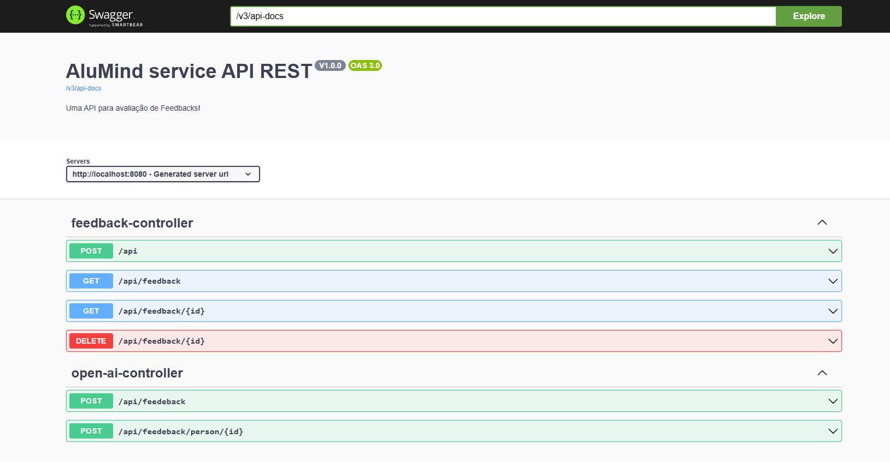
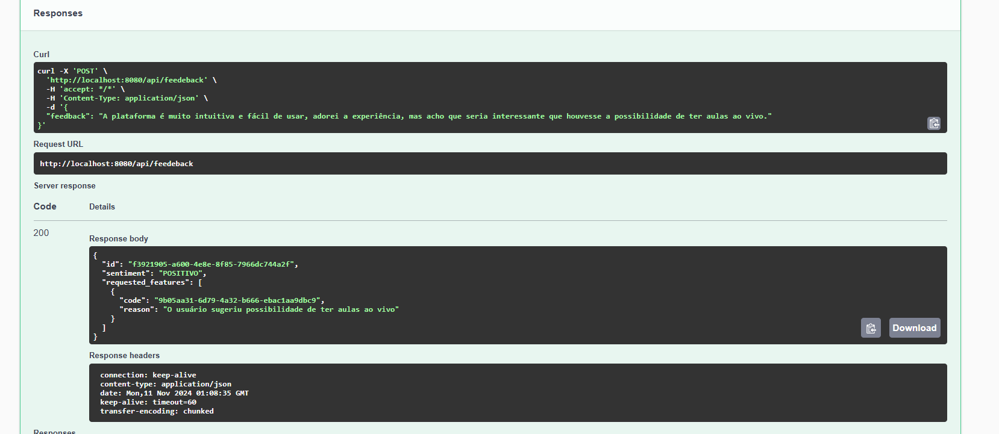
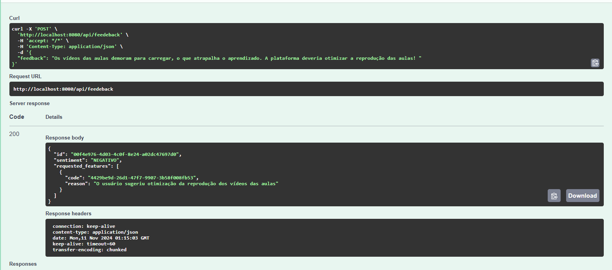
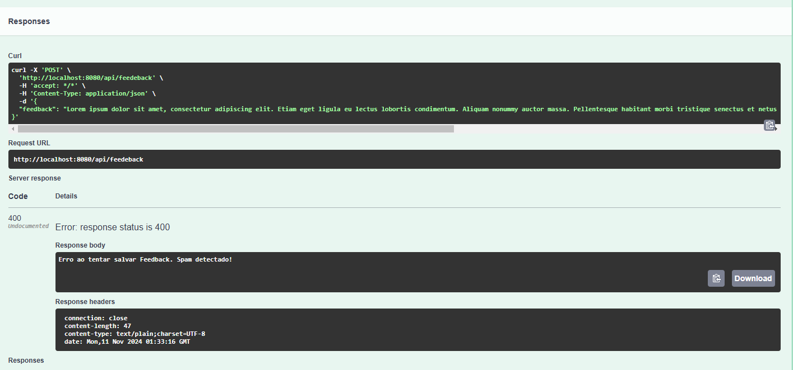
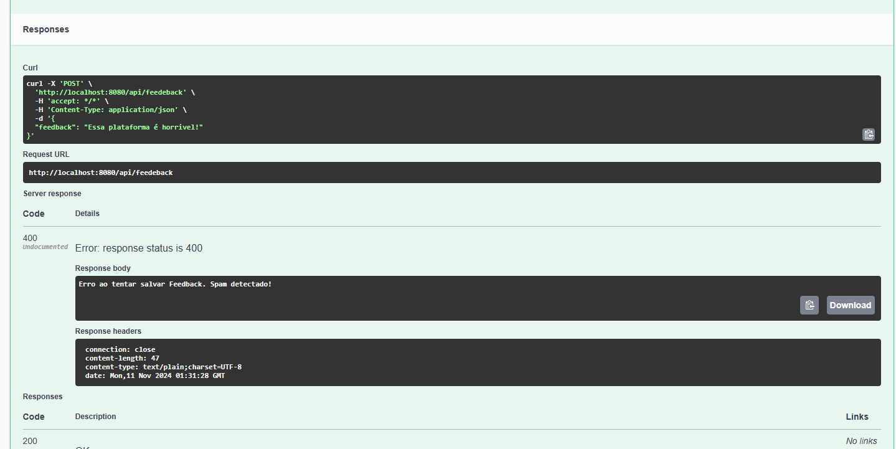

# AluMind
Este projeto proporciona uma API para avaliação de feedbacks com base nos sentimentos transmitidos no conteúdo das mensagens enviadas pelos usuários. O principal objetivo consiste em fazer uso de LLMs (Large Language Model), para classificar os feedbacks recebidos como positivos ou negativos, e a partir disso avaliar a mensagem e gerar resultados.
  ### Ferramentas ⚙️
  - Java (v21)
  - Maven (v3.^)
  - Docker
  ### Dependências e Bibliotecas 📚
  -  Spring Boot (v3.3.5)
  -  Spring Data JPA (v3.3.5)
  -  Spring AI(v1.0.0-M3)
  - OpenAI integration
  - Swagger
  - Lombok
  ### Ferramentas Banco de Dados 🏦
  - PostgresSQL (v19.1)
  - Flyway Core
  
  No Arquivo application.properties dentro do diretório resources, adicione as informações para conexão com seu banco de dados. Lembre-se de criar um banco localmente usando as mesmas configurações de acesso determinadas no arquivo application.properties.
  - Exemplo:
      - spring.datasource.url=jdbc:postgresql://localhost:5432/alumind_db
      - spring.datasource.username=postgres
      - spring.datasource.password=postgres
      
  ### Instruções OpenAI 🤖
A aplicação realiza uma integração com as ferramentas disponibilizadas pela API do OpenAI Chat, sendo assim caso ainda não possua uma conta no serviço da OpenAI, será necessário criá-la. [crie sua conta](https://auth.openai.com/authorize?audience=https%3A%2F%2Fapi.openai.com%2Fv1&auth0Client=eyJuYW1lIjoiYXV0aDAtc3BhLWpzIiwidmVyc2lvbiI6IjEuMjEuMCJ9&client_id=DRivsnm2Mu42T3KOpqdtwB3NYviHYzwD&device_id=9076a0de-c5c3-43cb-9b24-c91f82566242&issuer=https%3A%2F%2Fauth.openai.com&max_age=0&nonce=dWwwOXlHaHpXaXA0TjYwdERvY25icWVJMzd2ZVhFVU9TZTg3RjBzSTJkZw%3D%3D&redirect_uri=https%3A%2F%2Fplatform.openai.com%2Fauth%2Fcallback&response_mode=query&response_type=code&scope=openid+profile+email+offline_access&screen_hint=signup&state=Q0VON21QRjZWakdhUEJMRUJPVkJ2ZHI0fnFUSEc5STh2N1BiNHJZbUtnVQ%3D%3D&flow=treatment), também será necessário criar uma chave de API, acesse esse link [API key](https://platform.openai.com/api-keys) para mais informações sobre como criar sua chave de API. Por fim você deve anexar a sua chave no arquivo application.properties, nas configurações:
  - spring.ai.openai.api-key=API_KEY
  - openai.api.key=API_KEY;
  ### Compilação e execução 🚀
  No diretório principal do projeto inicie a aplicação executando os seguintes comandos (lembre-se de verificar se sua versão do maven e java estão corretos): 
  ```bash
  $  mvn clean install
  $  mvn spring-boot:run
  ```
### Usando um container 🐋
Caso não queira criar um banco localmente, ou se desejar você pode executar a aplicação usando um container docker. Para isso vá até o diretório principal do projeto e execute 
o comando para iniciar o container (certifique-se de ter o docker instalado e configurado em sua maquina):
 ```bash
  $  docker-compose up
  ```
### Migrações 📂
Após criar seu banco de dados localmente com as informações de usuário e senha execute o projeto. O arquivo de migração será executado automaticamente para criar a tabela "feedback" do banco, além de inserir dados fictícios de feedback. 
Caso deseje, você pode remover essa funcionalidade no arquivo application.properties atribuindo false na seguinte configuração: 
  - spring.flyway.enabled

## Respostas - Case

**Explicação da utilização do OpenAI:**

Optei por realizar a integração com a ferramenta da OpenAI para modelos de LLMs, devido sua praticidade, além de sua documentação detalhada e simples.

**Próximos passos:**

Umas das possíveis melhorias no projeto seria adicionar mais ferramentas disponibilizadas pelo framework do Spring AI, visto que esse possui uma gama enorme de funcionalidades que ajudam na integração de modelos LLMs em aplicações. Além disso, seria interessante adicionar novos modelos de LLM (como o google gemini) para disponibilizar diferentes abordagens de desenvolvimento.

**Documentação API**



**Case 1 - Classificação de Feedbacks Resposta da API:**

- Usuário envia feedback positivo



- Usuário envia feedback negativo



**Case 2 - Marcação de SPAM**

- Conteúdo do feedback sem relação com a AluMind



- **Feedback com conteúdo agressivo**



**Case 3 - Nova feature**

**Análise automatizada dos feedbacks para a criação de possíveis features ou melhorias na plataforma.**

A intenção é usar modelos de LLMs para avaliar os feedbacks realizados pelos usuários e que foram salvos na base de dados da aplicação. Por meio da avaliação o modelo de LLM deve processar os feedbacks negativos e analisar quais os problemas mais relevantes apontados pela análise, por exemplo o modelo determinou que muitos usuários fizeram feedbacks negativos em relação a demora para carregar os vídeos na plataforma. Dessa forma, o modelo pode auxiliar a equipe de desenvolvimento na criação de novas funcionalidades para amenizar a problemática. Essa abordagem iria contribuir a equipe para focar na resolução dos problemas mais relevantes na plataforma.

Além disso, ao serem lançadas novas funcionalidades e melhorias na plataforma, o modelo poderia filtrar o perfil dos usuários que realizaram feedbacks negativos e propor sugestões de ofertas para manter o usuário na plataforma.

Por exemplo, o modelo identificou que um usuário está bastante insatisfeito e que sua assinatura na plataforma está próxima de acabar, o modelo pode sugerir uma proposta de desconto para o usuário baseado no seu perfil e ressaltar que os problemas relatados pelo usuário foram tratados por meio das melhorias feitas feitas na plataforma, incentivando assim, o usuário a permanecer na plataforma.

**Case 4 - Geração de respostas personalizadas**

Para geração de respostas personalizadas foi usado uma requisição http Post, sendo necessário enviar o identificador único do feedback como parâmetro na requisição. Optei por fazer dessa forma, pois apesar da criação de respostas personalizadas e avaliação de feedbacks (como positivos ou negativos) usarem abordagens com LLMs, são duas funcionalidades diferentes dentro da aplicação. Ademais, a adesão de endpoints separados facilita a criação de respostas personalizadas usando diferentes modelos de LLM.

- Resposta personalizada para feedback positivo


- Resposta personalizada para feedback negativo


  


